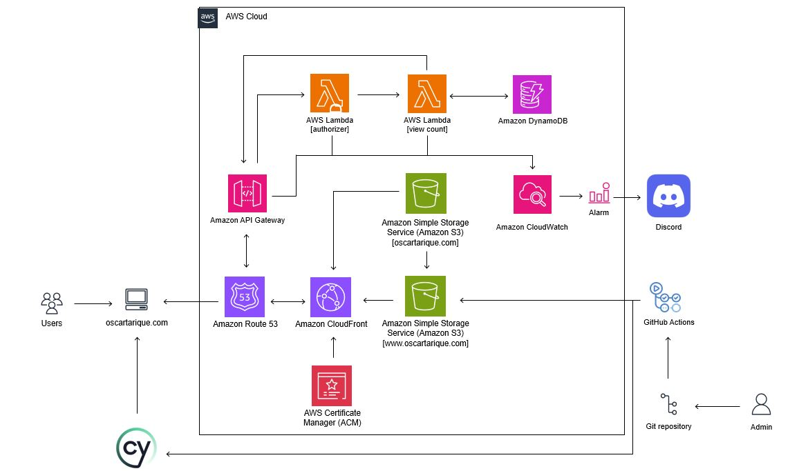

# Cloud Resume

This is a repo for how I created my [cloud resume website](https://www.oscartarique.com). 

Below is an architecture diagram to show the various AWS services used to create and deploy the static website hosting my resume:

All resources were deployed using Terraform.

# Table of Contents
- [Cloud Resume](#cloud-resume)
- [Table of Contents](#table-of-contents)
  - [1. Frontend](#1-frontend)
  - [2. Website deployment](#2-website-deployment)
  - [3. Github actions](#3-github-actions)
    - [3.1 Upload to S3 bucket](#31-upload-to-s3-bucket)
    - [3.2 Cypress](#32-cypress)
  - [4. Page view count](#4-page-view-count)
    - [4.1 DynamoDB](#41-dynamodb)
    - [4.2 Lambda function](#42-lambda-function)
    - [4.3 API gateway](#43-api-gateway)
  - [5. Monitoring](#5-monitoring)
  - [6. References](#6-references)
## 1. Frontend

I did not develop the frontend of the website but rather used this rather simple and elegant [template](https://tympanus.net/codrops/2018/01/12/freebie-scribbler-website-template-html-sketch/) and modified certain parts of it to my liking. 

Any website template can work but the cloud resume website is to serve as a condensed form of my full resume. Hence I prefered a short and simple website to showcase my skills and hope it wil

## 2. Website deployment

The website is deployed using AWS Cloudfront that points to a S3 bucket that serves the static content.

Below are the steps followed to deploy the website:

- Register a domain via Route 53.
- Generate a public certificate. This has to be done in the US East region as it is requirement for using Cloudfront.
- Create a S3 bucket for the subdomain (www.domain-name.com). The static website files are uploaded to this bucket.
- Create another S3 bucket for the root domain (domain-name.com). This bucket is setup as the redirect bucket that points to the subdomain bucket (redirects all requests for *domain-name*.com to www.*domain-name*.com). For this, we enable static website hosting using the redirect option.
- Setup Cloudfront distribution for subdomain bucket with the following:
  - Configure [OAC](https://docs.aws.amazon.com/AmazonCloudFront/latest/DeveloperGuide/private-content-restricting-access-to-s3.html) so that the subdomain bucket remains private and only allows requests from Cloudfront.
  - Redirect HTTP to HTTPS.
  - Add alternate domain name as www.*domain-name*.com.
  - Set the caching properties to **CacheDisabled**, which is one of [AWS' managed cache policies](https://docs.aws.amazon.com/AmazonCloudFront/latest/DeveloperGuide/using-managed-cache-policies.html). This gets rid of the need to invalidate our cache when doing updates to the website and always hit the S3 bucket for requests (which does go against one of Cloudfront's main use but acceptable for this project).
  - Attach public certificate.
- Setup Cloudfront distribution for root domain bucket with the following:
  - Configure it using website ending that was generated when setting the root domain S3 bucket for static website hosting.
  - Redirect HTTP to HTTPS.
  - Add alternate domain name as *domain-name*.com.
  - Set the caching properties to **CacheDisabled**.
  - Attach public certificate.
- Create records in the hosted zone shown in Route 53 for the two Cloudfront distributions. This will route the DNS traffic for the domain to the Cloudfront distribution.

## 3. Github actions

With the website up and running over HTTPS, we need to setup some automation with regards to our website files. 

### 3.1 Upload to S3 bucket
We do not want to have to manually upload our website files to S3 bucket everytime there is an edit. This can be automated using Github actions such that whenever there is an edit to the website files and pushed to the repo, it will automatically push the file(s) to the S3 bucket.

The steps outlined on [this page](https://aws.amazon.com/blogs/security/use-iam-roles-to-connect-github-actions-to-actions-in-aws/) outlines how to configure an OpenID Connect (OIDC) identity provider (IdP) inside an AWS account so that we can use IAM roles and short-term credentials, which removes the need for IAM user access keys.Short-term credentials are preferred as it reduces the overal risk compared to long-lived credentials.

The configuration consists of:
- Creating an OIDC providers using GitHub cert fingerprint
- Attaching a role to the provider that is restricted to the repo and allows access to the AWS account
- Attach a permission set to the role to perform the necessary action i.e. in this case, allow actions to be the performed on the S3 subdomain bucket.

After configurations is complete, we need create a workflow file that will be used by GitHub actions to authenticate inot the AWS account and performing the necessary action defined in the workflow. In this case, it will be a simple [sync function](https://blog.awsfundamentals.com/aws-s3-sync) that syncs the repo files with the S3 bucket.

### 3.2 Cypress

As an additional layer of testing, we use [Cypress](https://www.cypress.io/) to check that our website functions as expected.

Cypress is quite detailed in that you can run a multitude of tests and check almost every single element of your website. For the case of this static resume website, I only opted to test the below:

* Checking for links to my LinkedIn and Github.
* Testing the buttons related to the LinkedIn and Github links works as expected.
* Testing the API request gets a positive response (more details in [Section 4](#4-page-view-count)).
* Testing to see that view count for the page is updated accordingly (more details in [Section 4](#4-page-view-count)).

Cypress will also be run as part of the [Github actions workflow](https://github.com/cypress-io/github-action) after the website has been deployed.  

## 4. Page view count

One of the features of the static website is to show the number of views the page has had so far. This is acheived by using a combination of AWS services such as Lambda, DynamoDB and API gateway.

### 4.1 DynamoDB

We need to store the page view count data in a database and this is done in the NoSQL database, DynamoDB.

The structure of the database is quite simple in that it contains only one record that we will be updating every time the website is visited.

### 4.2 Lambda function

The Lambda function will contain the necessary logic and permissions to do two things:

- Retrieve the current value of the view count in DynamoDB
- Update the current value of the view count by one

### 4.3 API gateway

The API gateway is how the Lambda function for fetching and updating the view page count will be invoked. The API gateway url will be executed via a JavaScript code on the website.

To add a layer of security to the API gateway, we will configure [CORS](https://docs.aws.amazon.com/AmazonS3/latest/userguide/cors.html) for our domain and also an [authorizer](https://docs.aws.amazon.com/apigateway/latest/developerguide/apigateway-use-lambda-authorizer.html) so only requests orginating from our domain is accepted.

The authoriser is a Lambda function that will validate the origin of the request and if accepted, will allow the Lambda function for the page view count to be invoked. Else it will give a "Forbidden" or "Unauthorised" message.

We also setup throttling and rate
limiting on the API. This restricts the API
to process a certain number of requests in a given time period.

## 5. Monitoring

We need to setup some monitoring for our website so we are immediately notified of any issues. We will use Cloudwatch for this and setup the following alarms:

-   Alarm if API latency is unusually high
-   Alarm for errors on Lambda functions (failure to execute)
-   Alarm for an unusally high number of invocations of Lambda function over a set time

Furthermore, we will attach a SNS topic to these functions as an action that will trigger when the alarm goes into the 'ALARM' state.

We setup a SNS topic with a subscription that will send a message to a Discord channel and server. This is acheived by a Lambda function that parses the alarm details and uses the Discord webhook to send the message. This functionality is detailed in one of my [repo](https://github.com/OTarique/SNS_Discord).

## 6. References

- [Use an Amazon CloudFront distribution to serve a static website](https://docs.aws.amazon.com/Route53/latest/DeveloperGuide/getting-started-cloudfront-overview.html#getting-started-cloudfront-create-alias)
- [Restricting access to an Amazon S3 origin](https://docs.aws.amazon.com/AmazonCloudFront/latest/DeveloperGuide/private-content-restricting-access-to-s3.html)
- [Using the managed cache policies](https://docs.aws.amazon.com/AmazonCloudFront/latest/DeveloperGuide/using-managed-cache-policies.html)
- [Use IAM roles to connect GitHub Actions to actions in AWS](https://aws.amazon.com/blogs/security/use-iam-roles-to-connect-github-actions-to-actions-in-aws/)
- [Using GitHub Actions OIDC to run Terraform in AWS](https://awstip.com/using-github-actions-oidc-to-run-terraform-in-aws-31ba395518cb)
- [Using cross-origin resource sharing (CORS)](https://docs.aws.amazon.com/AmazonS3/latest/userguide/cors.html)
- [Use API Gateway Lambda authorizers](https://docs.aws.amazon.com/apigateway/latest/developerguide/apigateway-use-lambda-authorizer.html)
- [Working with AWS Lambda authorizers for HTTP APIs](https://docs.aws.amazon.com/apigateway/latest/developerguide/http-api-lambda-authorizer.html#http-api-lambda-authorizer.payload-format-response)
- []